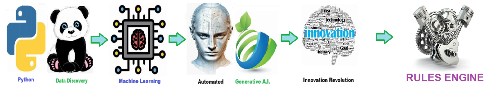

    
# Rules Engine 

## Automated rules engine for dynamically analyzing data quality.

    
The **data quality rules engine** is designed to identify and reject datasets of poor quality by rigorously applying predefined validation rules and criteria. 

When data fails to meet standards for completeness, accuracy, integrity, or other quality dimensions, the engine **flags these issues** and rejects the dataset. This ensures that only data meeting quality thresholds is accepted for further use, maintaining the integrity and reliability of the overall system.

The **rules engine** systematically processes data sets to evaluate their overall quality by applying predefined rules and criteria. 

As it iterates through each record, the engine checks for **completeness** by ensuring all required fields are filled, and assesses **structural integrity** by verifying that the data adheres to the expected format and structure. 

It evaluates **referential integrity** by confirming that relationships between different data entities are consistent and valid. 

**Accuracy checks** involve validating the correctness of the data against trusted sources or benchmarks. 

The engine also ensures **timeliness** by checking that the data is current and relevant. 

**Consistency checks** are performed to ensure uniformity across various data sets and systems. 

**Validity rules** confirm that the data meets predefined constraints and standards, while **uniqueness checks** ensure there are no duplicate entries. By systematically applying these rules, the engine provides a comprehensive assessment of the data quality, identifying areas that require correction or improvement.

 ## Pillars of Data Quality 
 1. **Completeness** - Ensures that all required data is present. 
  2. **Structural Integrity** - Ensures that the data adheres to the defined structure and format. 
  3. **Referential Integrity** - Ensures that data relationships are consistent and valid. 
  4. **Accuracy** - Ensures that data is correct and free from errors. 
  5. **Timeliness** - Ensures that data is up-to-date and available when needed. 
  6. **Consistency** - Ensures that data is uniform and consistent across different datasets and systems. 
  7. **Validity** - Ensures that data conforms to the defined rules and constraints. 
  8. **Uniqueness** - Ensures that each data element is unique and not duplicated. 
  

## Getting Started

The goal of this solution is to **Jump Start** your development and have you up and running in 30 minutes. 

To get started with the **Rules Engine** solution repository, follow these steps:
1. Clone the repository to your local machine.
2. Install the required dependencies listed at the top of the notebook.
3. Explore the example code provided in the repository and experiment.
4. Run the notebook and make it your own - **EASY !**
    
## Code Features

These features are designed to provide everything you need for **Rules Engine** 

- **Self Documenting** - Automatically identifes major steps in notebook 
- **Self Testing** - Unit Testing for each function
- **Easily Configurable** - Easily modify with **config.INI** - keyname value pairs
- **Includes Talking Code** - The code explains itself 
- **Self Logging** - Enhanced python standard logging   
- **Self Debugging** - Enhanced python standard debugging
- **Low Code** - or - No Code  - Most solutions are under 50 lines of code
- **Educational** - Includes educational dialogue and background material

    
## List of Figures
       
    

## Github https://github.com/JoeEberle/ - Email  josepheberle@outlook.com 
    

    